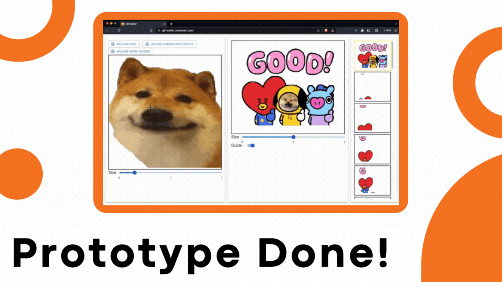

# Gif Editor

## https://gif-editor.onrender.com/

I wanted to make it easier to make silly gifs with my friend's face!

## To-do

- High res options
- More gifs & faces
- Export/import/save properties and gifs
- Crowdsourcing database
- Feature to flip face left/right
- ...

## Milestones

### Prototype Done
Finished basic functionality with image processing on backend and editor UI on frontend.

### Final Draft
Overhauled UI and added lots more functionality. Learned a lot about using HTTP requests. Made tutorials and instructions so friends can use it!

## Credits

[Multer](https://github.com/expressjs/multer)  
[Sharp](https://sharp.pixelplumbing.com/)  
[Express](https://expressjs.com/)  
[Create React App](https://github.com/facebook/create-react-app)  
[Material UI](https://mui.com/)  
[Arrow icon](https://icons8.com)  
[BeFunky Collage Maker](https://www.befunky.com/)  
[Canva](https://www.canva.com/)  
Various Images and Gifs—Internet  
God